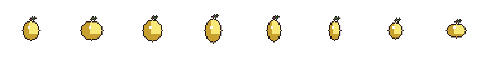

# QMcursor

Windows 上换鼠标指针样式的小工具。界面采用 B 站粉白风格，选一套喜欢的主题，点应用就行；也能改大小、开机自动套用。

<p align="center">
  
</p>


## 能做什么

- 切换 Windows 已安装的指针方案，或使用软件自带的主题
- 左侧按分类浏览：**系统指针**、**QMcursor 自制指针**、**ANI 指针**、**线框 cursor**
- 右侧实时预览各用途指针（含 ANI 动画）
- 调节指针大小
- 开机时自动重新应用你上次选的样式
- 应用前会备份当前设置，出问题可以一键恢复
- **原生 ANI 动画**：可导入 ANI 主题压缩包或文件夹，应用后由 Windows
  播放动画，关闭 QMcursor 仍然有效
- **物理摇摆**：指针会软跟随鼠标晃一晃；主题里如果有 `pendant.png`，还会在指针下面挂一条会晃的挂坠
- 开了物理摇摆后，关掉窗口会缩到托盘，挂坠继续跟着；要彻底关掉，请托盘右键选「退出」

## 环境要求

- Windows

## 怎么用

1. 打开 [Releases](https://github.com/Light-milk-tea/QMcursor/releases)，下载最新的 `QMcursor-windows.zip`
2. 解压到任意目录
3. 双击其中的 `QMcursor.exe` 启动

请保持 `QMcursor.exe` 与同目录下的 `_internal` 文件夹在一起，不要只单独复制 exe。

### 导入 ANI 动画主题

1. 点击窗口底部的「导入 ANI 包」
2. 选择包含 ANI 文件的 ZIP 压缩包或文件夹
3. 在 **ANI 指针**（或 **线框 cursor**）分类中选择带「系统动画」标记的主题并应用

支持 `Normal.ani`、`Busy.ani` 等常见安装包命名，也支持
`Arrow.ani`、`Wait.ani` 等 Windows 角色命名。导入内容保存在当前用户的
`%LOCALAPPDATA%\QMcursor\imported`，不会执行包内的 EXE/INF，也不需要写入
`Windows\Cursors`。

原生 ANI 与物理摇摆是两种不同模式：ANI 由 Windows 播放，QMcursor 可以退出；
物理摇摆由透明叠加层绘制，需要托盘常驻。选择 ANI 主题时物理摇摆会被禁用。

## 自带主题

软件内置多套指针，打开后在左侧分类中直接选择并应用：

| 分类 | 主题 | 说明 |
|------|------|------|
| ANI 指针 | 桃金娘 | 原生 17 角色 ANI 动画，关闭软件后仍由 Windows 播放 |
| QMcursor 自制指针 | 伊雷娜 | 完整 15 角色 CUR，含 `pendant.png`，可开物理摇摆 |
| QMcursor 自制指针 | 安洁莉娜小人 | 静态多尺寸 CUR |
| QMcursor 自制指针 | 塔菲新版、雷电将军新版 等 | 更多角色 CUR 主题 |
| 线框 cursor | （导入后显示） | 线框像素 ANI 包导入后归入此分类 |

## ANI 形态参考

项目制作新 ANI 光标时，以 Mon3tr 与魔理沙光标的角色态、功能态分布和逐帧节奏作为质量参考：

| 基准 | 普通选择 | 后台运行 | 忙碌 |
|------|----------|----------|------|
| Mon3tr |  |  |  |
| 魔理沙 |  |  |  |
| 桃金娘 |  |  |  |

相关文档：

- [ANI 动态鼠标指针制作标准流程](doc/ANI动态鼠标指针制作标准流程.md)
- [Mon3tr / 魔理沙风格 ANI 生成提示词](doc/Mon3tr魔理沙风格ANI光标生成提示词.md)
- [线框风格像素指针生成提示词](doc/线框风格像素指针生成提示词.md)

## 开发相关

需要 Python 3.11 或更新。在项目根目录执行：

```powershell
python -m venv .venv
.\.venv\Scripts\python.exe -m pip install -e ".[dev]"
.\.venv\Scripts\python.exe run.py
```

也可双击 `启动QMcursor.bat`（会自动建虚拟环境并启动）。

运行测试：

```powershell
.\.venv\Scripts\python.exe -m pytest
```

### 打包 Windows 可执行文件

```powershell
.\.venv\Scripts\python.exe -m pip install -e ".[build]"
.\.venv\Scripts\python.exe -m PyInstaller --noconfirm QMcursor.spec
```

产物位于 `dist/QMcursor/`，其中 `QMcursor.exe` 已嵌入伊蕾娜线框应用图标。
发布 zip 请放到 [GitHub Releases](https://github.com/Light-milk-tea/QMcursor/releases)，不要提交到仓库。

项目结构大致是：

- `src/qmcursor/`：程序代码
- `src/qmcursor/themes/`：内置指针主题（每个主题一个 `theme.json`）
- `src/qmcursor/resources/`：应用图标等资源
- `src/qmcursor/ui/theme_style.py`：B 站风格界面样式
- `tests/`：测试
- `doc/`：生图与说明文档
- `scripts/`：主题安装等辅助脚本
- `run.py`：开发启动入口

## 说明

- 只支持 Windows
- 物理摇摆靠透明叠加层实现，属于实验功能，个别全屏游戏或特殊软件里可能表现一般
- 单尺寸 ANI 在放大后可能变模糊；带多尺寸资源的主题会自动选择最接近的档位
- 本仓库地址：https://github.com/Light-milk-tea/QMcursor
